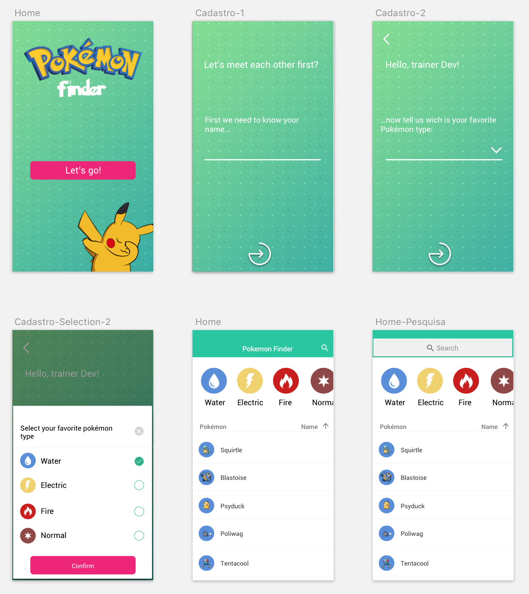

# Dev React Vortigo

You can also read a translated of this file in 
 - [Portuguese](./documents/README_PT.md)

***

This application has as premise to demonstrate some skills of a develop clearly, showing how the developer works technically.



# 💻 Technologies

-  [Node.js](https://nodejs.org/en/)
-  [React.js](https://reactjs.org/)

# 📚 Libraries

- [React router dom](https://reacttraining.com/react-router/)
- [axios](https://github.com/axios/axios)
- [styled-components](https://styled-components.com/)

# How to use?

## Development

When developing components, you may want assets automatically compiled and the browser to refresh automatically. To do this, run the following task:

```
> npm start
or
> yarn start
```

Open [http://localhost:3000](http://localhost:3000) to view it in the browser.

## Creating a static build

To create a static instance of this project, run the following task:

```
> npm run build
or
> yarn run build
```

---

# Arquiteture

Sometimes it’s helpful to know what all these different files are for…

```
/
├─ development/        # Development (Mocks, Fake server)
│
├─ public/             # Statics files
│
├─ src/
│  ├─ App/             # Main centralizer of all providers
│  │
│  ├─ assets/          # Assets
│  │
│  ├─ components/      # Components
│  │
│  ├─ helper/          # Helpers
│  │
│  ├─ pages/           # Pages
│  │  └─ <Page Name>/  # Folder that centralizes everything about the page
│  │      ├─ index     # Responsible for centralizes all bussiness
│  │      └─ styles    # Responsible for styles of page
│  │
│  ├─ routes/          # Centralize routes of Application
│  │
│  ├─ services/        # Services centralizes all external or internal services
│  │  ├─ api           # Responsible for apply settings about api
│  │  └─ storage       # Responsible for apply settings about storage local
│  │
│  └─ styles/          # Styles
│     ├─ animations    # Common animations
│     ├─ devices       # Constants about all devices types
│     ├─ global        # Settings global styles
│     └─ settings      # Constants about all application (colors, fonts...)
│
├─ .gitignore          # List of files and folders not tracked by Git
├─ .prettierrc         # Formatter preferences for JavasScript
├─ package.json        # Project manifest
└─ README.md           # This file
```
