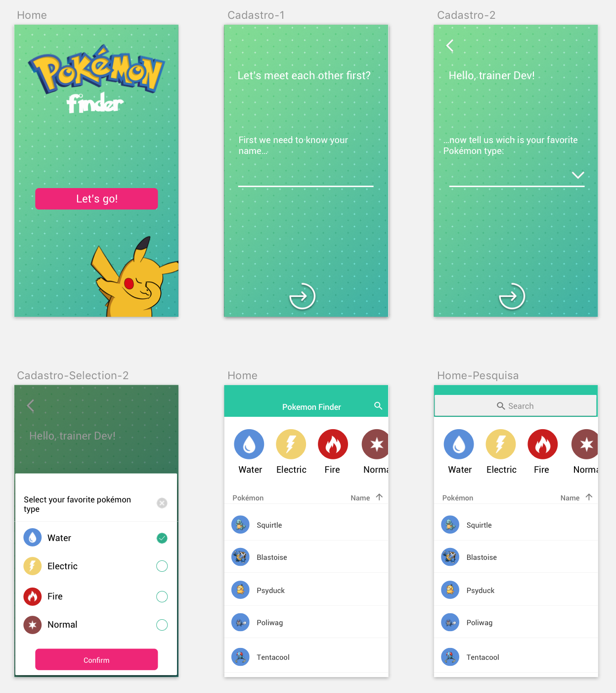

# Dev React Vortigo

Você também pode ler este arquivo traduzido em

- [English](../README.md)

---

Esta aplicação tem como premissa demonstrar algumas skills de um desenvolver de forma clara, mostrando como o desenvolvedor trabalha tecnicamente



# 💻 Tecnologias

-  [Node.js](https://nodejs.org/en/)
-  [React.js](https://reactjs.org/)

# 📚 Bibliotecas

- [React router dom](https://reacttraining.com/react-router/)
- [axios](https://github.com/axios/axios)
- [styled-components](https://styled-components.com/)

# Como usar?

## Desenvolvimento

Ao desenvolver componentes, convém que os ativos sejam compilados automaticamente e o navegador seja atualizado automaticamente. Para fazer isso, execute a seguinte tarefa:

```
> npm start
or
> yarn start
```

Abra [http://localhost:3000](http://localhost:3000) para visualizar no browser.

## Criando um build estático

Para criar uma instância do projeto estático, execute a seguinte tarefa:

```
> npm run build
or
> yarn run build
```

---

# Arquitetura

Às vezes, é útil saber para que servem todos esses arquivos diferentes ...

```
/
├─ development/        # Desenvolvimento (Dados "mochados", Fake server)
│
├─ public/             # Arquivos estáticos (html, js, css)
│
├─ src/
│  ├─ App/             # Centralizador de todos os providers
│  │
│  ├─ assets/          # Arquivos estáticos (media, icons, fonts)
│  │
│  ├─ components/      # Componentes
│  │
│  ├─ helper/          # "Ajudante"
│  │
│  ├─ pages/           # Páginas
│  │  └─ <Page Name>/  # Diretorio que centraliza tudo que compoe uma pagina.
│  │      ├─ index     # Responsável por centralizar a regra de negocio.
│  │      └─ styles    # Responsável pela estilização da página.
│  │
│  ├─ routes/          # Centralizador de rotas da aplicação
│  │
│  ├─ services/        # Centralizador de serviços externos ou internos da aplicação.
│  │  ├─ api           # Responsável por aplicar configurações da API.
│  │  └─ storage       # Responsável por aplicar configurações de armazenamento do browser.
│  │
│  └─ styles/          # Styles
│     ├─ animations    # Animações comum
│     ├─ devices       # Constantes de todos os tipos de dispositivos
│     ├─ global        # Configuração global de estilo
│     └─ settings      # Constantes de toda a aplicação (cores, fontes...)
│
├─ .gitignore          # Lista de arquivos e pastas a não serem rastreados pelo Git.
├─ .prettierrc         # Formatador da linguagem usada.
├─ package.json        # Manifesto do projeto
└─ README.md           # Este arquivo
```
